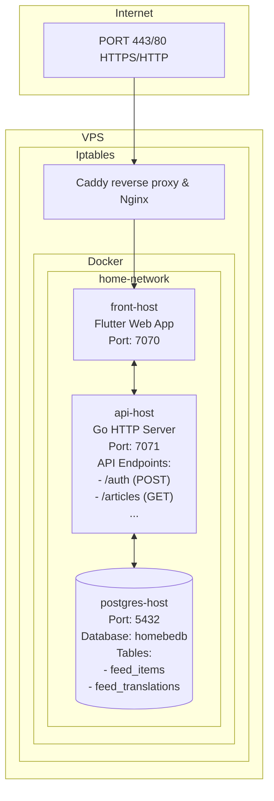
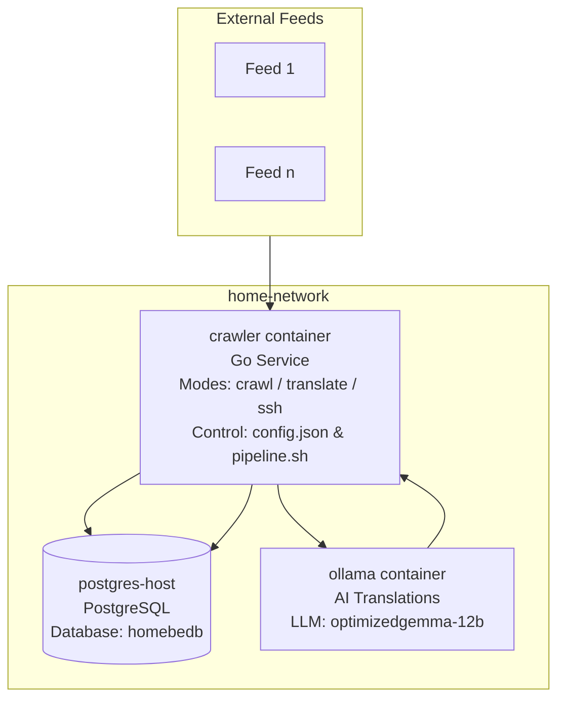

# System Architecture

## Overview

A Flutter (Dart) frontend application communicating with a Golang backend, both running in Docker containers connected via a shared Docker network. The backend serves as the API layer connecting to a PostgreSQL database for persistent storage.

---

## 1. Application Layers

### Frontend
- **Language**: Dart/Flutter
- **Version**: >=3.41.5 (minimum required version)
- **Port**: 7070
- **Container Name**: `front-host`
- **Reverse Proxy**: Nginx (HTTPS via Caddy config)
- **Architecture**: Mobile/Desktop/Web hybrid app
- **Key Features**: 
  - RSS feed aggregation and display
  - Multi-platform support (iOS, Android, Desktop)
  - Localization support (English, Thai locales)
  - Image caching with thumbnail generation

### Backend
- **Language**: Go (Golang)
- **Version**: 1.26.2
- **Port**: 7071
- **Container Name**: `api-host`
- **HTTP Server**: Net/http stdlib or third-party framework
- **Database**: PostgreSQL (`postgres://postgres:<pass>@host/homebedb?sslmode=disable`)
- **Security**: 
  - Endpoints require JWT token in Authorization header
  - CORS enabled globally

### Data Layer
- **Database**: PostgreSQL container on `home-network`
- **Port**: 5432
- **Container Name**: `postgres-host`
- **Connection String**: `postgres://postgres:<pass>@host/homebedb?sslmode=disable`
- **Usage**: Backend stores and retrieves news content, user preferences, configuration

---

## 2. Architecture



**Terminology:**
- **VPS**: Virtual Private Server
- **Iptables**: Firewall
- **Caddy**: Reverse proxy
- **Nginx**: Web server
- **Docker**: Container runtime
- **PostgreSQL**: Database management system

**Caddy/Nginx → Frontend → Backend → PostgreSQL**

*User requests (HTTPS) via reverse proxy serve front-end container, which communicates with backend via hostnames directly within Docker network. Database connection requires internal hostname resolution only.*

---

## 3. API Endpoints

### Backend API Endpoints (api-host:7071)

Endpoints require authentication via JWT token in Authorization header.

#### Content Management Endpoints
- **GET /articles**
  - **Purpose**: Retrieve news items with pagination
  - **Parameters**: 
    - `offset` (optional, default: 0) - Pagination offset
    - `limit` (optional, default: 10) - Items per page
    - `lang` (optional) - Language filter
  - **Response**: NewsItems object with articles
  <!-- - **Used by**: `archive()` method -->

- **GET /article**
  - **Purpose**: Retrieve news item
  - **Parameters**: 
    - `lang` (optional) - Language filter
  - **Response**: Individual NewsItem object

- **GET /search**
  - **Purpose**: Search news articles by query
  - **Parameters**:
    - `q` (required) - Search query string
    - `lang` (optional) - Language filter
  - **Response**: NewsItems object with search results
  <!-- - **Used by**: `search()` method -->

- **GET /refresh**
  - **Purpose**: Trigger refresh of RSS feeds/content
  - **Response**: Status code and data
  - **Used by**: Editors only (not readers)

#### Configuration Endpoints
- **GET /jq**
  - **Purpose**: Retrieve backend configuration
  - **Response**: Config object with backend settings
  <!-- - **Used by**: `getConfig()` method -->

#### Authentication Endpoints
- **POST /auth**
  - **Purpose**: Authenticate user and obtain JWT token
  - **Response**: Token object with JWT token and user information
  <!-- - **Used by**: `login()`, `refreshLogin()` methods -->

### Frontend API Implementation

The Flutter frontend uses the `ApiRepository` class with the following pattern:
```dart
// All requests follow this structure:
List<Future<dynamic>> futures = [];
futures.add(client.get('/endpoint'));
List<dynamic> results = await Future.wait(futures);
```

**Key Implementation Details**:
- Uses `Future.wait()` for concurrent request handling
- Error handling with try-catch blocks and logging
- Response parsing into strongly-typed Dart objects (PODOs)

---

## 4. Communication Patterns

### Frontend ↔ Backend API

**Request Format**:
```dart
// Flutter frontend makes requests like:
Dio().get(
  'http://0.0.0.0:7071/sites', 
);
```

**Backend Response Format**:
```json
{
  "status": 200,
  "data": {
    "sites": [
      {
        "name": "Site Name",
        "url": "https://example.com/rss",
        "language": "en"
      }
    ]
  }
}
```

**Authentication**: All requests require JWT token in Authorization header (bearer token)

### Docker Container Communication

- **Network**: `home-network` (user-defined bridge network)
- **Service Discovery**: Containers communicate via container names (`api-host`, `front-host`)
- **No DNS needed** within the same network - direct hostname resolution

---

## 5. Frontend & Backend Tooling

### Build Outputs
- Frontend: `build/web/`
- Backend: Compiled binary `home_be_backend`

### Makefile Targets
- `make deps`    → Install vendor dependencies
- `make`         → Build binary for current platform
- `make debug`   → Debug build (with dev index.html)
- `make release` → Production build (with release index.html)
- `make clean`   → Clean build artifacts

### Frontend Dependencies
```yaml
dio:                          # HTTP client for API calls
url_launcher:                 # Open external links in browser/native apps
flutter_bloc:                 # State management (Bloc pattern)
go_router:                    # Navigation/Router
flutter_svg:                  # SVG image support
share_plus:                   # Native share integration
rss_dart:                     # RSS feed parsing
html:                         # HTML rendering for feed content
timeago:                      # Relative time formatting ("2h ago")
collection:                   # Utility collections and helpers
logger:                       # Logging framework
flutter_secure_storage:       # Secure storage for sensitive data in prod builds
shared_preferencies:          # Non-secure storage for debug builds
intl:                         # Internationalization utilities
json_annotation:              # JSON serialization annotations
```

### Backend Dependencies
```yaml
github.com/golang-jwt/jwt/v5  # JWT authentication
github.com/google/uuid        # UUID generation
github.com/joho/godotenv      # Environment variable loader
github.com/lib/pq             # PostgreSQL driver
github.com/mmcdole/gofeed     # RSS feed parsing
github.com/tailscale/hujson   # Human-friendly JSON parsing
golang.org/x/crypto           # Cryptographic utilities
```

---

## 6. UI Architecture & Design System

### Responsive Design Strategy

The application implements a **dual UI architecture** with separate layouts for different device orientations and form factors:

```dart
bool get _usePortraitUi =>
    defaultTargetPlatform == TargetPlatform.iOS || defaultTargetPlatform == TargetPlatform.android;
```

**UI Layout Selection Logic**:
- **Portrait Mode** (`ui_portrait/`): Mobile devices (iOS, Android)
- **Landscape Mode** (`ui_landscape/`): Desktop, Web, Tablet devices

### Screen Architecture

**Core Screens** (implemented in both orientations):
- **LoginScreen** (`login_screen.dart`) - Authentication interface
- **ArticlesScreen** (`articles_screen.dart`) - Historical news browsing
- **ArticleScreen** (`article_screen.dart`) - Individual news article view
- **ListTile** (`list_tile.dart`) - Consistent list item styling

**Editor Screens** (implemented in both orientations):
- **DashboardScreen** (`dashboard_screen.dart`) - Editors navigation hub
- **AnimatedFlags** (`animated_flags.dart`) - Locale selection with flag animations

### Navigation System

**GoRouter Implementation**:
```dart
final GoRouter router = GoRouter(
  routes: [
    GoRoute(path: '/', builder: (context, state) => 
      _usePortraitUi ? portrait.LoginScreen() : landscape.LoginScreen()),
    GoRoute(path: 'dashboard', builder: (context, state) => 
      _usePortraitUi ? portrait.DashboardScreen() : landscape.DashboardScreen()),
    // ... additional routes
  ],
);
```

**Route Structure**:
- `/` - Login screen (auto-selects orientation)
- `/dashboard` - Main dashboard
- `/articles` - News articles browser
- `/article/:id` - News article detail view

### Theme System

**Material 3 Design System**:
- **Light/Dark Themes**: Full theme switching support
- **Platform Adaptation**: Responsive design parameters per platform
- **Color Scheme**: Comprehensive Material 3 color implementation
- **Cupertino**: Material 3 adapted to Cupertino for iOS and other Apple platforms

**Theme Architecture**:
```dart
class AppTheme {
  static const ColorScheme _lightColorScheme = ColorScheme(
    // ... comprehensive color definitions
  );
  
  static ThemeData getThemeForPlatform({required bool isDarkMode}) {
    // ... platform-specific theme adaptations
  }
}
```

**Responsive Design Parameters**:
```dart
class _AdaptMobile {
  // ... mobile-optimized spacing and sizing
}
```

### State Management Integration

**Bloc Pattern Implementation**:
- **ThemeCubit**: Theme switching (light/dark mode)
- **ModeCubit**: App mode (heavy/very heavy)
- **LocaleCubit**: Language/locale management
- **LoginBloc**: Authentication state
- **DrawerBloc**: Drawer state management
- **ArticlesBloc**: News list screen state management
- **ArticleBloc**: News article detail screen state management

### Internationalization Architecture

- **Supported Locales**: German, Russian, English, Finnish, Portuguese, Spanish, Thai, Japanese
- **Generated Localizations**: Automated code generation for type safety
- **Dynamic Locale Switching**: Runtime language switching without app restart

### WASM Compilation Benefits

**Performance Advantages**:
- **Faster startup time**: WASM modules load quicker than JavaScript
- **Better runtime performance**: Near-native execution speed
- **Reduced bundle size**: More efficient binary format
- **Improved memory management**: Better garbage collection

**Browser Compatibility**:
- **Modern browsers**: Chrome, Firefox, Safari, Edge (all support WASM)
- **Fallback support**: Automatic JavaScript fallback for older browsers
- **Mobile optimization**: Enhanced performance on mobile devices

**Nginx Configuration**:
The included Nginx configuration (`nginx.release.conf`) includes:
- Proper MIME type for `.wasm` files
- CORS headers for WASM module loading
- Security headers compatible with WASM execution

```nginx
# WebAssembly support in nginx config
types {
    application/wasm wasm;
}
add_header Cross-Origin-Embedder-Policy "credentialless" always;
add_header Cross-Origin-Opener-Policy "same-origin" always;
```

---

## 8. Security Considerations

### Authentication
**Token**: More secure implementation depending on needs in future

### CORS Configuration
- Backend enables CORS for all origins (development mode)
- Should be restricted in production

### Network Security
- Uses HTTPS via Caddy reverse proxy
- Docker network isolation between containers
- Database on separate host requires external access control

---

## 9. Database Schema & Structure

### Database Configuration
- **Database**: PostgreSQL
- **Connection**: Configured via `DATABASE_URL` environment variable
- **SSL Mode**: Disabled (`sslmode=disable`) for internal network communication
- **Connection Pool**: 
  - Max Open Connections: 30
  - Max Idle Connections: 20
  - Connection Lifetime: 5 minutes
  - Idle Timeout: 5 minutes

### Core Tables

#### `feed_items`
Stores RSS feed articles and news items.

**Columns**:
```sql
- id (UUID, PRIMARY KEY)
- title (TEXT)
- content (TEXT)
- link (TEXT, UNIQUE)
- published_parsed (TIMESTAMP)
- feed_source (TEXT)
- created_at (TIMESTAMP, DEFAULT NOW())
- updated_at (TIMESTAMP, DEFAULT NOW())
```

**Indexes**:
- `idx_feed_items_published` on `published_parsed` (for chronological queries)
- `idx_feed_items_source` on `feed_source` (for feed filtering)
- `idx_feed_items_link` on `link` (unique constraint)

#### `feed_translations`
Stores AI-generated translations of feed items.

**Columns**:
```sql
- id (UUID, PRIMARY KEY)
- feed_item_id (UUID, FOREIGN KEY → feed_items.id)
- language (TEXT)
- translated_title (TEXT)
- translated_content (TEXT)
- translated_at (TIMESTAMP, DEFAULT NOW())
- created_at (TIMESTAMP, DEFAULT NOW())
```

**Indexes**:
- `idx_translations_item_id` on `feed_item_id` (for item lookups)
- `idx_translations_language` on `language` (for language filtering)
- `idx_translations_translated_at` on `translated_at` (for chronological queries)

### Database Statistics & Monitoring

The backend provides real-time database statistics through the `/jq` endpoint:

**Connection Statistics**:
- Max Open Connections
- Currently Open Connections
- Connections In Use
- Idle Connections
- Wait Count and Duration
- Connection Closure Statistics

**Content Statistics**:
- Total Feed Items count
- Total Feed Translations count
- Newest/Oldest Feed Item timestamps
- Newest/Oldest Feed Translation timestamps

### Database Operations

#### Content Management
- RSS feed parsing and insertion via `gofeed` library
- Automatic duplicate detection based on link uniqueness
- Timestamp management for published vs created dates

#### Translation Workflow
- AI translation requests via Ollama integration
- Translation storage with language tagging
- Relationship maintenance between original and translated content

### Performance Considerations

#### Query Optimization
- Pagination support for articles endpoints (`offset`, `limit` parameters)
- Language-based filtering for multilingual content
- Chronological ordering for news display

#### Connection Management
- Connection pooling to prevent database overload
- Configurable timeouts for query execution
- Graceful handling of database unavailability

### Database Initialization

#### Setup Requirements
```bash
# Create database
createdb homebedb

# Set environment variable
export DATABASE_URL="postgres://postgres:<user>@<host>:<port>/homebedb?sslmode=disable"
```

#### Schema Creation
```sql
-- Feed items table
CREATE TABLE feed_items (
    id UUID PRIMARY KEY DEFAULT gen_random_uuid(),
    title TEXT NOT NULL,
    content TEXT,
    link TEXT UNIQUE NOT NULL,
    published_parsed TIMESTAMP,
    feed_source TEXT,
    created_at TIMESTAMP DEFAULT NOW(),
    updated_at TIMESTAMP DEFAULT NOW()
);

-- Translations table
CREATE TABLE feed_translations (
    id UUID PRIMARY KEY DEFAULT gen_random_uuid(),
    feed_item_id UUID NOT NULL REFERENCES feed_items(id),
    language TEXT NOT NULL,
    translated_title TEXT,
    translated_content TEXT,
    translated_at TIMESTAMP DEFAULT NOW(),
    created_at TIMESTAMP DEFAULT NOW()
);

-- Indexes for performance
CREATE INDEX idx_feed_items_published ON feed_items(published_parsed);
CREATE INDEX idx_feed_items_source ON feed_items(feed_source);
CREATE INDEX idx_feed_items_link ON feed_items(link);
CREATE INDEX idx_translations_item_id ON feed_translations(feed_item_id);
CREATE INDEX idx_translations_language ON feed_translations(language);
CREATE INDEX idx_translations_translated_at ON feed_translations(translated_at);
```

### Database Access Patterns

#### Read Operations
- **Articles queries**: Paginated retrieval with language filtering
- **Search operations**: Full-text search across titles and content
- **Configuration retrieval**: RSS site configuration management

#### Write Operations
- **Feed ingestion**: RSS parsing and item insertion
- **Translation storage**: AI-generated content persistence
- **Content updates**: Manual content modifications

### Error Handling & Recovery

#### Connection Failures
- Automatic retry logic for transient failures
- Connection pool management for overload scenarios
- Graceful degradation when database is unavailable

#### Data Integrity
- Unique constraints prevent duplicate feed items
- Foreign key constraints maintain translation relationships
- Transaction management for complex operations

---

## 10. API Implementation Details

### Server Setup

- **Framework**: Standard Go `net/http` package
- **Router**: `http.NewServeMux()` for route handling
- **Port**: Configurable via `config.json` (default: `:7071`)
- **Timeouts**: 30 seconds for both read and write operations
- **Graceful Shutdown**: 5-second timeout with signal handling

### Middleware Order

Requests pass through the backend in this order:

```go
Request -> HTTP server -> corsMiddleware -> httpRouter -> endpoint handler
```

The CORS middleware applies headers before route handling and short-circuits preflight requests:

```go
func corsMiddleware(next http.Handler) http.Handler {
    return http.HandlerFunc(func(w http.ResponseWriter, r *http.Request) {
        w.Header().Set("Access-Control-Allow-Methods", "GET, POST, PUT, DELETE, OPTIONS")
        w.Header().Set("Access-Control-Allow-Headers", "Content-Type")
        w.Header().Set("Access-Control-Allow-Origin", "https://techeavy.news")
        
        if r.Method == http.MethodOptions {
            w.WriteHeader(http.StatusNoContent)
            return
        }
        next.ServeHTTP(w, r)
    })
}
```

### Route Registration Pattern

```go
httpRouter.HandleFunc("GET /endpoint", handler)
httpRouter.HandleFunc("OPTIONS /endpoint", handler)

corsRouter := corsMiddleware(httpRouter)
http.Handle("/endpoint", corsRouter)
```

Each API route is registered on the `ServeMux`, then wrapped by the shared CORS middleware before being attached to the default HTTP handler.

### Development vs Production Differences

- **Debug**: `-tags debug` with development index.html
- **Release**: `-tags release` with production index.html
- **Version Injection**: Build-time version information
- **Development**: Local database, relaxed CORS
- **Production**: Remote database, restricted CORS
- **Logging**: Verbose development vs minimal production logs

---

## 11. News Feed Processing & Translation Pipeline

### Overview

The news feed processing pipeline is a standalone service responsible for aggregating news feeds from multiple sources and generating multilingual translations using custom Ollama AI models.

### Pipeline Architecture



### Core Components

#### News Feed Crawling

**Data Processing:**
- News feeds parsed using `gofeed` library
- Content deduplication via UUID-based hashing
- Text truncation (title: 450 chars, description: 950 chars)
- Chronological sorting by publication date
- Automatic thumbnail extraction and fallback handling

#### AI Translation System

**Translation Model:**
- **Model**: `optimizedgemma-12b` (custom fine-tuned Gemma 12B)
- **Temperature**: 0.4 (reduced creativity for consistent translations)
- **Context Length**: 1024 / 2048 (pipeline doesn't use chat history)

**Translation Logic:**
- Professional translation prompts with technical term preservation
- Fallback to title translation when description is empty
- Content filtering (removes URLs, comment references)
- Duplicate translation prevention via database constraints

### Performance Optimizations

#### Translation Efficiency
- **Model Optimization**: Custom fine-tuned Gemma 12B model
- **Batch Processing**: Processes items in configurable batches
- **Connection Pooling**: Reuses Ollama client connections for multiple translations
- **Content Preprocessing**: Filters out URLs and metadata to reduce token usage

#### Database Performance
- **UUID Indexing**: Fast duplicate detection using UUID-based content hashing
- **Chronological Ordering**: Indexes on `published_parsed` for efficient time-based queries
- **Foreign Key Constraints**: Ensures data integrity between items and translations
- **ON CONFLICT Handling**: Prevents duplicate insertions with PostgreSQL UPSERT

#### Resource Management
- **Memory Constraints**: Text truncation prevents memory overflow during processing
- **Concurrent Processing**: Goroutine-based execution for parallel feed processing
- **Graceful Error Handling**: Continues processing individual items even if some fail

### Monitoring & Maintenance

#### Health Checks
- **Ollama Service**: Verifies AI service availability before translation
- **Database Connectivity**: Tests PostgreSQL connection before operations
- **Feed Availability**: Logs failed RSS feed fetches for monitoring

#### Logging Strategy
- **Timestamped Logs**: All operations include precise timing information
- **Error Tracking**: Comprehensive error logging with context
- **Progress Monitoring**: Item-by-item progress reporting during operations

#### Data Retention
- **Automatic Cleanup**: Configurable data retention policies
- **Backup Strategy**: Compressed daily backups with offsite storage
- **Migration Support**: Database schema versioning for upgrades

### Integration Points

#### Backend API Integration
The crawler populates the same PostgreSQL database used by the main backend, enabling seamless integration with the frontend application through existing API endpoints.

#### Translation API Consumption
Frontend applications can access translated content through the standard backend API endpoints, with language selection handled by the existing internationalization system.

#### Monitoring Integration
Pipeline metrics and health status can be integrated with the existing monitoring dashboard for comprehensive system observability.

---
