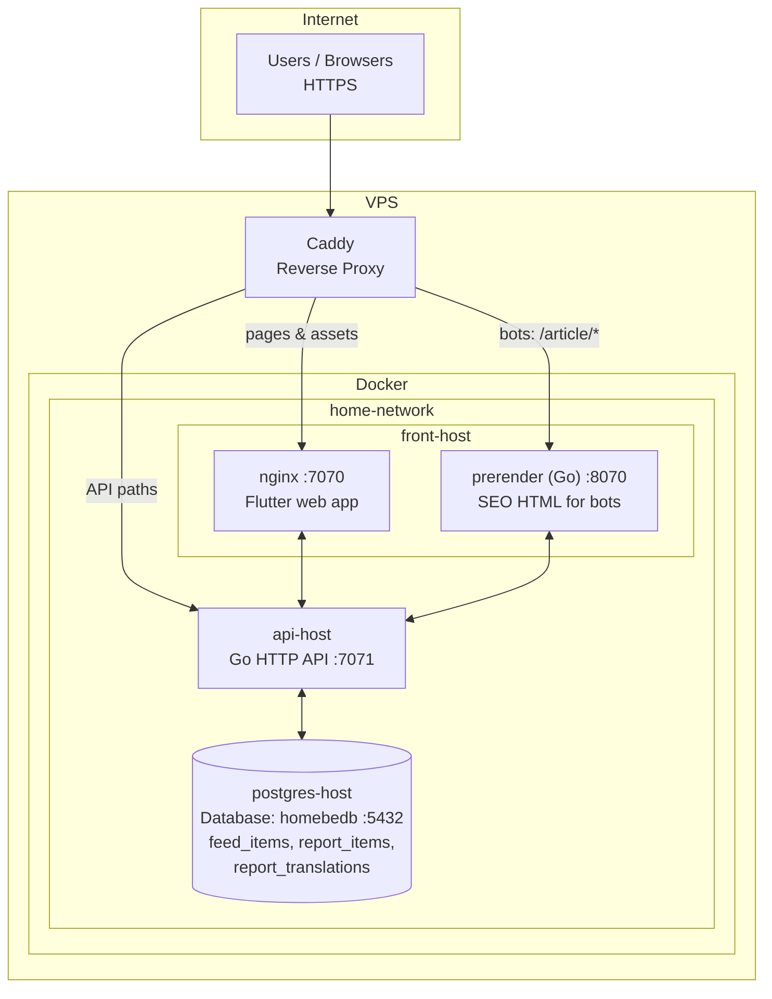

# System Architecture

## Overview

A Flutter (Dart) web application served by nginx, communicating with a Golang API backend, both running in Docker containers connected via a shared Docker network. The backend serves articles, search, feeds and media from a PostgreSQL database.

Content is generated by an AI reporter pipeline using open source intelligence.

---

## 1. Application Layers

### Frontend
- **Language**: Dart/Flutter
- **Version**: Flutter 3.47.0, Dart SDK 3.13.0
- **Ports**: 7070 (nginx serving the app), 8070 (prerender sidecar)
- **Container Name**: `front-host`
- **Web Server**: nginx inside the container, reverse proxied by Caddy
- **Build**: JavaScript (debug), WebAssembly (release)
- **Key Features**:
  - Article browsing with pagination and search
  - Article detail view: markdown content, images, video, text-to-speech
  - Editor dashboard: feed explorer, article create/edit/delete
  - Light/dark themes, keyboard shortcuts
  - Localization: 9 languages with runtime switching

### Backend
- **Language**: Go (Golang)
- **Version**: 1.26.2
- **Port**: 7071
- **Container Name**: `api-host`
- **HTTP Server**: Standard `net/http` with `ServeMux` (Go 1.22 method-based routing)
- **Architecture**: Clean architecture (`domain` → `usecase` → `repository` → `delivery/http`)
- **Database**: PostgreSQL via `DATABASE_URL` environment variable
- **Security**:
  - JWT (HS256) bearer tokens on write/feed endpoints
  - CORS policy differs between debug and release builds

### Data Layer
- **Database**: PostgreSQL container on `home-network`
- **Port**: 5432
- **Container Name**: `postgres-host`
- **Database**: `homebedb`
- **Tables**: `feed_items`, `report_items`, `report_translations` (schema defined by the AI reporter pipeline; read/written by the backend)

### Prerender Sidecar
- **Language**: Go, runs inside `front-host` alongside nginx (supervised by `start.sh`)
- **Port**: 8070
- **Purpose**: Renders enriched HTML for `/article/*` requests from search-engine bots, and serves `/robots.txt` and `/sitemap.xml`

---

## 2. Architecture


```mermaid
graph TB
    subgraph Internet
        B["Users / Browsers<br/>HTTPS"]
    end

    subgraph VPS["VPS"]
        A["Caddy<br/>Reverse Proxy"]
        subgraph Docker["Docker"]
            subgraph Network["home-network"]
                subgraph FH["front-host"]
                    D["nginx :7070<br/>Flutter web app"]
                    P["prerender (Go) :8070<br/>SEO HTML for bots"]
                end
                C["api-host<br/>Go HTTP API :7071"]
                E[(postgres-host<br/>Database: homebedb :5432<br/>feed_items, report_items,<br/>report_translations)]
            end
        end
    end

    B --> A
    A -->|pages & assets| D
    A -->|bots: /article/*| P
    A -->|API paths| C
    D <--> C
    P <--> C
    C <--> E
```

**Flow:** User requests arrive via Caddy, which routes normal traffic to nginx (`front-host:7070`), crawler traffic on article URLs to the prerender sidecar (`front-host:8070`), and API paths to the Go backend (`api-host:7071`). The backend reads/writes PostgreSQL (`postgres-host:5432`). The prerender sidecar also fetches article data from the API.

---

## 3. API Endpoints

### Public Endpoints (no authentication)

| Method | Path | Parameters | Purpose |
|---|---|---|---|
| GET | `/get_articles` | `limit` (1–999, default 10), `offset` (0–999999, default 0), `lang` (default `en`) | Paginated list of articles |
| GET | `/get_single_article` | `aid` (required), `lang` | Single article |
| GET | `/article_image` | `aid` (required), `kind` (`thumbnail` \| `main`) | Article image bytes (ETag, immutable cache) |
| GET | `/article_video` | `aid` (required) | Article video file |
| GET | `/get_available_languages` | — | Distinct languages with translations (always includes `en`) |
| GET | `/search` | `q` (required, max 20 chars), `lang` | Case-insensitive search over topic/summary/events |
| GET | `/jq` | — | Runtime metrics JSON (uptime, Go runtime stats, version) |
| POST | `/auth` | body: `username`, `password` | Login, returns JWT |

### Protected Endpoints (JWT bearer required)

| Method | Path | Parameters | Purpose |
|---|---|---|---|
| POST | `/create_article` | body: topic, dateRange, summary, events, registry, language | Create article (generates 11-char `aid`) |
| PUT | `/update_article` | body incl. `aid` | Update article |
| DELETE | `/delete_article` | `aid` | Delete article and its translations |
| GET | `/get_feeds` | `limit` (default 10), `source` (optional) | List of feed items |
| GET | `/get_single_feed` | `uuid` (required) | Single feed item |
| DELETE | `/delete_feed` | `uuid` (required) | Delete feed item |

Notes:
- Every route is also registered for `OPTIONS` (CORS preflight).
- Supported `lang` values come from `config.json` (`en, es, de, fi, ru, th, ja, zh, ko`).
- A Prometheus `GET /metrics` handler exists but is not registered.

---

## 4. Communication Patterns

### Frontend ↔ Backend

- HTTP client: **dio** (`lib/api/`), wrapped by `ApiClient` and `ApiRepository`.
- Base URL from the `APP_API` dart-define (default `http://api-host:7071`).
- `AuthInterceptor` attaches `Authorization: Bearer <token>` to every request and clears the token on 401.
- Lightweight in-memory response cache (`ResponseCache`, default TTL 30s; `/jq` and `/get_available_languages` cached 5 min).
- Responses are plain JSON — no envelope.

### JWT Storage
- The token is held **in memory** for the session.
- The logged-in user object is persisted via `Storage`, which routes web/WASM to `flutter_secure_storage` and other platforms to `shared_preferences`, and restored on startup (`AuthBloc` `LoadEvent`).

---

## 5. Frontend & Backend Tooling

### Backend Makefile Targets
- `make deps`    → Regenerate `go.mod`/`go.sum`, re-vendor, `go fmt`
- `make`         → Build with the flavor from `.env` `ENV=` (default `debug`)
- `make debug`   → Build with `-tags debug`
- `make release` → Build with `-tags release`
- `make clean`   → Clears Go caches, removes `vendor/`, `go.mod`, `go.sum` and the binary (destructive)
- `make help`    → List targets

Build tags: exactly one of `debug`/`release` must be set. `release` enables production behavior (restricted CORS origin, editor login disabled). Version is injected via `-X main.version` (git describe).

### Frontend Makefile Targets
- `make deps`      → `flutter pub get` + `build_runner`
- `make debug`     → `flutter build web --debug` (JavaScript)
- `make release`   → `flutter build web --wasm --release` (WebAssembly)
- `make seo-check` → Validates SEO name/description consistency and bans legacy wording
- `make clean`     → Clean build artifacts

Builds inject `--dart-define=APP_API` (from `.env` `API_URL=`) and `APP_VERSION`.

### Frontend Dependencies (key)
```yaml
dio:                       # HTTP client
flutter_bloc:              # State management (Bloc)
go_router:                 # Navigation/Router
html:                      # HTML rendering for feed content
intl:                      # Internationalization
timeago:                   # Relative time formatting
flutter_svg:               # SVG support (flags)
flutter_secure_storage:    # Secure storage on web/WASM
shared_preferences:        # Storage on other platforms
share_plus:                # Native share integration
formz:                     # Form state management
flutter_markdown_plus:     # Markdown rendering of article content
flutter_tts:               # Text-to-speech
google_fonts:              # Noto Sans font
video_player:              # Article video playback
url_launcher:              # Open external links
json_annotation:           # JSON serialization
```

### Backend Dependencies
```yaml
github.com/golang-jwt/jwt/v5   # JWT authentication
github.com/joho/godotenv       # Environment variable loader
github.com/lib/pq              # PostgreSQL driver
github.com/matoous/go-nanoid/v2 # Article ID generation
github.com/tailscale/hujson    # Human-friendly JSON config parsing
golang.org/x/crypto            # bcrypt password hashing
```

---

## 6. UI Architecture & Design System

### Dual Layout Architecture

Screens exist in two variants, selected by target platform:

```dart
bool get _portraitMode =>
    defaultTargetPlatform == TargetPlatform.iOS || defaultTargetPlatform == TargetPlatform.android;
```

- **`ui_portrait/`** — mobile layouts (iOS, Android)
- **`ui_landscape/`** — desktop/web layouts

The deployed app is web-only, but every screen ships both variants.

### Screens

| Route | Screen |
|---|---|
| `/` | `ArticlesScreen` — article list with pagination and search |
| `/article/:aid` | `ArticleViewScreen` — article detail (markdown, media, TTS, share) |
| `/dashboard` | `DashboardScreen` — editor hub |
| `/login` | `LoginScreen` — authentication |
| `/add_article` | `ArticleAddScreen` — create article |
| `/edit_article/:aid` | `ArticleEditScreen` — edit article |
| `/disclaimer` | `DisclaimerScreen` — per-language disclaimer |

- `/articles` redirects to `/` (preserving query params).
- Router `errorBuilder` falls back to `LoginScreen`.
- URL path strategy: `usePathUrlStrategy()` on web/WASM.

Shared widgets live in `lib/ui/`: drawer, article chips, article image, registry entry cards, spinner, TTS listen chip, video card.

### State Management (flutter_bloc)

- **ThemeCubit** — light/dark/system theme, persisted
- **LocaleCubit** — active locale; honors `?lang=` URL param, storage, then system
- **AuthBloc** — login/logout/session restore
- **DrawerBloc** — drawer state, fetches `/jq` backend info
- **ArticlesBloc** — article list, search, languages, load-more pagination
- **ArticleBloc** — article detail + add/edit/delete
- **FeedsBloc** — feed list + delete
- **ArticleFormCubit / ArticleEditFormCubit** — formz-based form validation

### Internationalization

- **Supported Locales**: `en, es, de, ru, fi, th, ja, zh, ko`
- Generated type-safe localizations from ARB files (`l10n.yaml`, `lib/assets/i18n/`)
- Runtime language switching via `LocaleCubit` (no restart)
- Localized relative times via `timeago` message sets

### Theme System

- **Material 3** with full light/dark `ColorScheme`s (primary blue)
- Platform dispatch in `getThemeForPlatform()`: Cupertino-flavored `ThemeData` for iOS
- Mobile adjustments: smaller text scale and compact paddings
- Font: Noto Sans via `google_fonts`

### WebAssembly

Release builds ship WASM only (debug builds are JavaScript). nginx serves `application/wasm` MIME type and the security headers required by WASM: `Cross-Origin-Embedder-Policy: credentialless`, `Cross-Origin-Opener-Policy: same-origin`, and a CSP allowing `'wasm-unsafe-eval'`.

### SEO / Prerender

A Go sidecar on port 8070 renders server-side HTML for `/article/*` when the requester is a search-engine bot, and serves `/sitemap.xml` and `/robots.txt`. It reads the same `API_URL` as the app.

---

## 7. Security Considerations

### Authentication
- `POST /auth` validates against **in-memory users** (bcrypt-hashed), defined in `user_repo.go`: `Jay` (Editor), `anonymous` (Reader).
- On success the backend issues an HS256 JWT (1-year expiry) signed with `JWT_SECRET` (required env var — startup fails without it).
- **Editor login is disabled in production builds** (`-tags release`).

### Endpoint Protection
- JWT required only on: `create_article`, `update_article`, `delete_article`, `get_feeds`, `get_single_feed`, `delete_feed`.
- All read endpoints (articles, search, images, videos, languages, `/jq`) are public.

### CORS
- Allowed methods: GET, POST, PUT, DELETE, OPTIONS
- Allowed headers: `Content-Type, Authorization`
- Origin: `*` in debug builds; `https://example.com` in release builds
- Preflight requests short-circuit with 204

### Server Hardening
- Timeouts: read 10s, write 20s, idle 60s
- Graceful shutdown on SIGINT/SIGTERM with a 5s timeout

---

## 8. Database Schema & Structure

### Configuration
- Connection: `DATABASE_URL` environment variable (`sslmode=disable`)
- Pool: max open 30, max idle 20, connection lifetime 5 min, idle timeout 5 min
- Schema is created by the AI reporter pipeline; the backend reads and writes these tables.

### `feed_items`
Source news material collected for report generation.

```sql
id               SERIAL PRIMARY KEY,
title            VARCHAR(1000) NOT NULL,
description      VARCHAR(2000) NOT NULL,
content          VARCHAR(3000),
link             VARCHAR(1500) NOT NULL,
published        TIMESTAMP NOT NULL,
published_parsed TIMESTAMP NOT NULL,
source           VARCHAR(300) NOT NULL,
thumbnail        VARCHAR(1500),
uuid             VARCHAR(300) NOT NULL UNIQUE,
language         VARCHAR(10) NOT NULL,
created          TIMESTAMP DEFAULT NOW(),
updated          TIMESTAMP DEFAULT NOW()
```

### `report_items`
Generated articles/reports served by the API.

```sql
id                SERIAL PRIMARY KEY,
aid               VARCHAR(11) NOT NULL UNIQUE,   -- public article id
link              VARCHAR(500) NOT NULL,
title             VARCHAR(1000) NOT NULL DEFAULT '',
topic             VARCHAR(500) NOT NULL,
date_range        VARCHAR(200) NOT NULL,
summary           TEXT NOT NULL,
events            TEXT NOT NULL,
registry          JSONB NOT NULL DEFAULT '[]',   -- source registry
image_description TEXT,
video_script      TEXT,
thumbnail         BYTEA,
main_image        BYTEA,
images            JSONB NOT NULL DEFAULT '[]',   -- image metadata
video             JSONB NOT NULL DEFAULT '[]',   -- video metadata
show_video        BOOLEAN NOT NULL DEFAULT FALSE,
created           TIMESTAMP DEFAULT NOW(),
updated           TIMESTAMP DEFAULT NOW()
```

### `report_translations`
Per-language translations of reports.

```sql
id                SERIAL PRIMARY KEY,
report_id         INTEGER NOT NULL REFERENCES report_items(id),
language          VARCHAR(10) NOT NULL,
title             VARCHAR(1000) NOT NULL DEFAULT '',
topic             VARCHAR(500) NOT NULL,
date_range        VARCHAR(200) NOT NULL,
summary           TEXT NOT NULL,
events            TEXT NOT NULL,
registry          JSONB NOT NULL DEFAULT '[]',
image_description TEXT,
video_script      TEXT,
created           TIMESTAMP DEFAULT NOW(),
UNIQUE(report_id, language)
```

### Access Patterns
- **Listing**: paginated queries ordered chronologically, filtered by language
- **Search**: case-insensitive (`ILIKE`) over topic, summary, events
- **Media**: images served from `BYTEA`/JSONB columns via `/article_image` and `/article_video`
- **Languages**: distinct languages from `report_translations` (plus `en`)

---

## 9. Backend Implementation Details

### Package Layout (clean architecture)

```
main.go                        # entry point (version injection)
cmd/api/                       # application wiring & HTTP server lifecycle
cmd/utils/hash.go              # CLI helper: bcrypt hash generation
internal/domain/               # entities & interfaces
internal/usecase/              # business logic
internal/repository/           # PostgreSQL access, in-memory users, metrics formatting
internal/delivery/http/        # handlers, router, middleware
infrastructure/postgres/       # DB connection & pool
infrastructure/jwt/            # HS256 token service
infrastructure/metrics/        # in-memory HTTP stats
config/                        # hujson config loader
build/                         # debug/release build-tag helpers
```

### Configuration
`config.json` (loaded with hujson, so comments/trailing commas are tolerated):
- `server.port` — default `:7071`
- `supportedLanguages` — `en, es, de, fi, ru, th, ja, zh, ko`
- `videoDir` — directory for article video files

### Request Flow

```
Request → HttpHandler (logging & stats) → CORSMiddleware → ServeMux
       → authMiddleware (protected routes only) → handler
```

Routes are registered with Go 1.22 method patterns (`"GET /get_articles"`), each with a matching `OPTIONS` entry. Protected routes are wrapped with `authMiddleware`, which validates the `Authorization: Bearer` header against the JWT service.

### `/jq` Runtime Metrics

Returns process/Go runtime information: uptime, OS, architecture, app version, Go version, CPU count, goroutine count, GOMAXPROCS, cgo call count. The frontend drawer uses this as backend info. (Per-request method/path/status/duration stats are also tracked in memory, feeding the unregistered Prometheus handler.)

---

## 10. Content Generation

Content is produced by a separate AI reporter pipeline using open source intelligence, which populates `feed_items`, `report_items` and `report_translations`. The backend described here serves that content.
